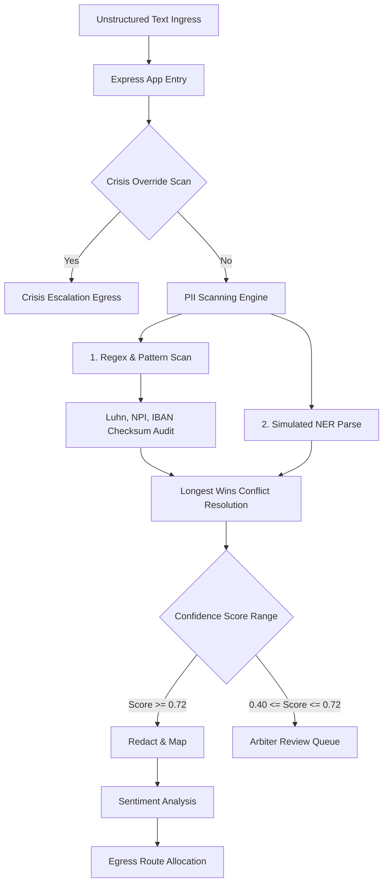

# Technical Requirements Document (TRD)
## PII Redaction & Compliance Gateway

### 1. System Architecture
The application is structured as a single-repository client-server microservice.



### 2. Algorithmic Specifications

#### 2.1 Checksum Validators
- **Luhn Modulo 10** (`validateLuhn`):
  Strips non-digits, reverses numbers, doubles every alternate digit starting from the right. If doubled value exceeds 9, subtract 9. If the total sum is divisible by 10, the digit is valid.
- **National Provider Identifier** (`validateNPI`):
  Prepend implicit health identifier `80840` for standalone 10-digit NPIs (equivalent to a +24 checksum offset). Validate using double-alternate Luhn Modulo 10.
- **IBAN Modulo 97** (`validateIBAN`):
  Rearrange the first 4 characters to the end. Substitute letters with numbers (A=10, B=11, ... Z=35). Evaluate division modulo 97. Valid if the remainder is exactly 1.

#### 2.2 Conflict Resolution: Longest Match Wins
When multiple regexes or entity sweeps report matches overlapping the same string positions, overlapping entries are sorted by starting index ascending, and length descending. The engine discards any smaller span whose start index falls within a previous longer entity's range:
```typescript
detected.sort((a, b) => {
  if (a.startIndex !== b.startIndex) return a.startIndex - b.startIndex;
  return (b.endIndex - b.startIndex) - (a.endIndex - a.startIndex);
});
```

### 3. API Route Specifications

#### `POST /api/redact`
- **Request Body**:
  ```json
  {
    "text": "Dr. Alexander Mercer (NPI: 1013498522) was outstanding.",
    "confidenceThreshold": 0.5,
    "enabledTypes": ["PERSON", "US_NPI"],
    "redactionStyle": "standard"
  }
  ```
- **Response Body**:
  ```json
  {
    "originalText": "Dr. Alexander Mercer (NPI: 1013498522) was outstanding.",
    "redactedText": "Dr. {{PERSON_1}} (NPI: {{US_NPI_1}}) was outstanding.",
    "mapping": {
      "{{PERSON_1}}": "Alexander Mercer",
      "{{US_NPI_1}}": "1013498522"
    },
    "entities": [...],
    "overrideDetected": false,
    "sentiment": "POSITIVE",
    "destinationDB": "Marketing Database",
    "destinationURL": "DB_MARKETING_URL"
  }
  ```

#### `POST /api/restore`
- **Request Body**:
  ```json
  {
    "redactedText": "Hello {{PERSON_1}}",
    "mapping": {
      "{{PERSON_1}}": "Pat Patient"
    }
  }
  ```
- **Response**:
  ```json
  {
    "restoredText": "Hello Pat Patient"
  }
  ```

#### `POST /api/compliance/summarize`
- **Request Body**:
  ```json
  {
    "redactedText": "Dr. {{PERSON_1}} NPI {{US_NPI_1}}",
    "templateType": "clinical"
  }
  ```
- **Response**:
  ```json
  {
    "responseText": "### Clinical Summary\n- Dr. {{PERSON_1}} completed...",
    "isSimulated": true,
    "templateType": "clinical"
  }
  ```

### 4. Deployment Specifications
- **Build Server Target**: Render / Node.js
- **Environment Settings**:
  - `NODE_ENV`: `production`
  - `PORT`: `3000` (defaults to local environment override)
- **Compilation Tooling**:
  - Frontend compiled to static assets via **Vite** (`dist/`).
  - Backend bundled to CJS module via **esbuild** (`dist/server.cjs`).
